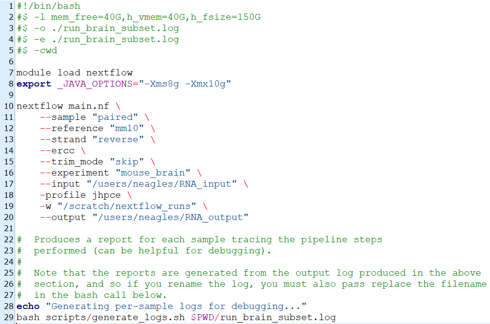

# Setup Details {#setup-details}

## Requirements

SPEAQeasy requires that the following be installed:

- Java 8 or later
- Python 3 (tested with 3.7.3), with pip

If java is not installed, you can install it on linux with `apt install default-jre`, or with a different package manager you prefer. Python 3 and pip (automatically installed with typical installations of python) are required as well. These installations are typically done by an administrator (they require root access/ use of "sudo").

SPEAQeasy has been tested on Linux, but it designed to run on any of a number of POSIX-compliant systems, including MacOS and FreeBSD.

## Installation

SPEAQeasy makes use of a number of different additional software tools. The user is provided two options to automatically manage these dependencies.

- *Docker*: The recommended option is to manage software with docker, if it is available. From within the repository, perform the one-time setup by running `bash install_software.sh "docker"`. This installs nextflow and sets up some test files. When running SPEAQeasy, the required docker images are automatically pulled if not already present, and components of the pipeline run within the associated containers. A full list of the images that are used is [here](#software).
- *Local install*: The alternative is to locally install all dependencies. This is done by running `bash install_software.sh "local"` from within the repository. This installs nextflow, several bioinformatics tools, R and packages, and sets up some test files. A full list of software used is [here](#software). The script `install_software.sh` builds each software tool from source, and hence relies on some common utilities which are often pre-installed in many unix-like systems:

    * A C/C++ compiler, such as [GCC](https://gcc.gnu.org/) or [Clang](http://clang.llvm.org/index.html)
    * The GNU `make` utility
    * The `makeinfo` utility
    * [git](https://git-scm.com/), for downloading some software from their GitHub repositories
    * The `unzip` utility

## Run the Pipeline

The "main" script used to run the pipeline depends on the environment you will run it on.

### Run in a SLURM environment/ cluster

- (Optional) **Adjust configuration**: hardware resource usage, software versioning, and cluster option choices are specified in *conf/slurm.config*, if you have installed software dependencies locally, or *conf/docker_slurm.config* if you will use docker.
- **Modify the main script and run**: the main script is *run_pipeline_slurm.sh*. Submit as a job to your cluster with `sbatch run_pipeline_slurm.sh`. If you are using docker, make sure to change the line `-profile slurm` to `profile docker_slurm`. See the [full list of command-line options](#command-opts) for other details about modifying the script for your use-case.

See [here](https://www.nextflow.io/docs/latest/executor.html#slurm) for Nextflow's documentation regarding SLURM environments.

### Run on a Sun Grid Engines (SGE) cluster

- (Optional) **Adjust configuration**: hardware resource usage, software versioning, and cluster option choices are specified in *conf/sge.config*, if you have installed software dependencies locally, or *conf/docker_sge.config* if you will use docker.
- **Modify the main script and run**: the main script is *run_pipeline_sge.sh*. Submit as a job to your cluster with `qsub run_pipeline_sge.sh`. If you are using docker, make sure to change the line `-profile sge` to `profile docker_sge`. See the [full list of command-line options](#command-opts) for other details about modifying the script for your use-case.

See [here](https://www.nextflow.io/docs/latest/executor.html#sge) for additional information on nextflow for SGE environments.

### Run locally

- (Optional) **Adjust configuration**: hardware resource usage and other configurables are located in *conf/local.config*, if you have installed software dependencies locally, or *conf/docker_local.config* if you will use docker. Note that defaults assume access to 8 CPUs and 16GB of RAM.
- **Modify the main script and run**: the main script is *run_pipeline_local.sh*. If you are using docker, make sure to change the line `-profile local` to `profile docker_local`. After configuring options for your use-case (See the [full list of command-line options](#command-opts)), simply run on the command-line with `bash run_pipeline_local.sh`.

### Run on the [JHPCE](https://jhpce.jhu.edu/) cluster

- (Optional) **Adjust configuration**: hardware resource usage, software versioning, and cluster option choices are specified in *conf/jhpce.config*
- **Modify the main script and run**: this is *run_pipeline_jhpce_qsub.sh*. The pipeline run is submitted to the cluster by executing `qsub run_pipeline_jhpce.sh`. See the [full list of command-line options](#command-opts) for details about modifying the script you choose.

### Example main script

Below is a full example of a typical main script, modified from the `run_pipeline_jhpce.sh` script. At the top are some cluster-specific options, recognized by SGE, the grid scheduler at the JHPCE cluster. These are optional, and you may consider adding appropriate options similarly, if you plan to use SPEAQeasy on a computing cluster.

After the main call, `nextflow main.nf`, each command option can be described line by line:

- `--sample "paired"`: input samples are paired-end
- `--reference "mm10"`: these are mouse samples, to be aligned to the mm10 genome
- `--strand "reverse"`: the user expects the samples to be reverse-stranded, which SPEAQeasy will verify
- `--ercc`: the samples have ERCC spike-ins, which the pipeline should quantify as a QC measure.
- `--trim_mode "skip"`: trimming is not to be performed on any samples
- `--experiment "mouse_brain"`: the main pipeline outputs should be labelled with the experiment name "mouse_brain"
- `--input "/users/neagles/RNA_input"`: `/users/neagles/RNA_input` is a directory that contains the `samples.manifest` file, describing the samples.
- `-profile jhpce`: configuration of hardware resource usage, and more detailed pipeline settings, is described at `conf/jhpce.config`, since this is a run using the JHPCE cluster
- `-w "/scratch/nextflow_runs"`: this is a nextflow-specific command option (note the single dash), telling SPEAQeasy that temporary files for the pipeline run can be placed under `/scratch/nextflow_runs`
- `--output "/users/neagles/RNA_output"`: SPEAQeasy output files should be placed under `/users/neagles/RNA_output`



### Advanced info regarding installation

- If you are installing software to run the pipeline locally, all dependencies are installed into `[repo directory]/Software/`, and `[repo directory]/conf/command_paths_long.config` is configured to show nextflow the default installation locations of each software tool. Thus, this config file can be tweaked to manually point to different paths, if need be (though this shouldn't be necessary).
- Nextflow supports the use of Lmod modules to conveniently point the pipeline to the bioinformatics software it needs. If you neither wish to use docker nor wish to install the many dependencies locally-- and already have Lmod modules on your cluster-- this is another option. In the appropriate config file (as determined in step 3 in the section you choose below), you can include a module specification line in the associated process (such as `module = 'hisat2/2.2.1'` for buildHISATindex) as configured in *conf/jhpce.config*. In most cases this will be more work to fully configure, and so running the pipeline with docker or locally installing software is generally recommended instead. See [nextflow modules](https://www.nextflow.io/docs/latest/process.html#module) for some more information.

## Sharing the pipeline with many users

A single installation of SPEAQeasy can be shared among potentially many users. New users can simply copy the appropriate "main" script (determined above) to a different desired directory, and modify the contents as appropriate for the particular experiment.

**Note** It is recommended to use a unique working directory with the `-w` [option](#next-opts) for each experiment. This ensures:
- SPEAQeasy resumes from the correct point, if ever stopped while multiple users are running the pipeline
- Deleting the work directory (which can take a large amount of disk space) does not affect SPEAQeasy execution for other users

New users who wish to include the `--coverage` [option](#command-opts) must also install RSeQC personally:

```{bash, eval=FALSE}
python3 -m pip install --user RSeQC==3.0.1
```

### Customizing execution for each user

By default, all users will share the same [configuration](#configuration). This likely suffices for many use cases, but alternatively new configuration files can be created. Below we will walk through an example where a new user of a SLURM-based cluster wishes to use an existing SPEAQeasy installation, but wants a personal configuration file to specify different annotation settings.

1. **Copy the existing configuration to a new file**

```{bash, eval=FALSE}
#  Verify we are in the SPEAQeasy repository
pwd

#  Create the new configuration file
cp conf/slurm.config conf/my_new.config
```

2. **Modify the new file as desired**

Below we will change the GENCODE release to the older release 25, for human, via the `gencode_version_human` variable.
```{groovy, eval=FALSE}
executor = 'slurm'

params {
  gencode_version_human = "25" // originally was "32"!
  gencode_version_mouse = "M25"
  ensembl_version_rat = "98"
  anno_build = "main" // main or primary (main is canonical seqs only)
```

See [configuration](#configuration) for details on customizing SPEAQeasy settings.

3. **Add the new file as a "profile"**

This involves adding some code to `nextflow.config`, as shown below.

```{groovy, eval=FALSE}
profiles {
  // Here we've named the new profile "my_new_config", and pointed it to the
  // file "conf/my_new.config". Note that docker users should have the 2nd line
  // "includeConfig 'conf/command_paths_short.config'" instead!
  my_new_config {
    includeConfig 'conf/my_new.config'
    includeConfig 'conf/command_paths_long.config'
  }
  
  // This configuration had already existed
  local {
    includeConfig 'conf/local.config'
    includeConfig 'conf/command_paths_long.config'
  }
```

4. **Reference the new profile in the "main" script**

Recall that new users should copy the "main" script and modify the copy as appropriate. In this case, we open a copy of the original `run_pipeline_slurm.sh`:
```{groovy, eval=FALSE}
#  At the nextflow command, we change the '-profile' argument at the bottom
$ORIG_DIR/Software/nextflow main.nf \
    --sample "single" \
    --reference "hg19" \
    --strand "unstranded" \
    --small_test \
    --annotation "$ORIG_DIR/Annotation" \
    -with-report execution_reports/pipeline_report.html \
    -with-dag execution_DAGs/pipeline_DAG.html \
    -profile my_new_config # this was changed from "-profile slurm"!
```
