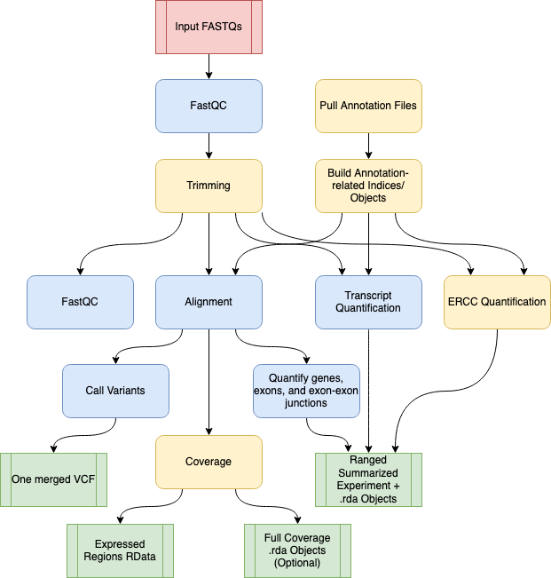

# Pipeline Overview {#pipeline-overview}

*Diagram representing the "conceptual" workflow traversed by SPEAQeasy. Here some nextflow [`processes`](https://www.nextflow.io/docs/latest/process.html) are grouped together for simplicity; the exact processes traversed are enumerated below. The red box indicates the FASTQ files are inputs to the pipeline; green coloring denotes major output files from the pipeline; the remaining boxes represent computational steps. Yellow-colored steps are optional or not always performed; for example, preparing a particular set of annotation files occurs once and uses a cache for further runs. Finally, blue-colored steps are ordinary processes which occur on every pipeline execution.*

## Preparation Steps

The following processes in the pipeline are done only once for a given configuration, and are skipped on all subsequent runs:

### Downloading required annotation files ###

* *PullAssemblyFasta*: when using default [annotation](#annotation), this process pulls the genome fasta from [GENCODE](https://www.gencodegenes.org/) or [Ensembl](https://useast.ensembl.org/index.html) and saves to the directory specified by `--annotation`. This is the file against which FASTQ reads are aligned.
* *PullGtf*: similarly to *PullAssemblyFasta*, this process pulls the ".gtf" transcript annotation file.
* *PullTranscriptFasta*: similar to the above two processes, this one pulls the fasta of transcript sequences (against which FASTQ reads are pseudoaligned).

### Preparing annotation files for direct use ###

* *BuildAnnotationObjects*: a number of files are produced for internal use by SPEAQeasy. These include a text file of sequence ranges and a few R data files with annotation information (regarding genes, junctions, and exons).
* *BuildHISATIndex*: the HISAT2 aligner requires an indexed genome- this process builds that file for the given genome fasta.
* *BuildKallistoIndex*: similarly to HISAT2, the transcript quantification tool Kallisto requires that the transcripts be indexed. This process builds the required index.
* *BuildSalmonIndex*: when Salmon is used as the pseudoaligner (with the [command option](#command-opts) `--use_salmon`), an index like that for Kallisto is built in this process.

## Main Workflow Steps

* *QualityUntrimmed*: FASTQ files are ran through FastQC as a preliminary quality control measure. By default, the presence of "adapter content" determined in this process decides whether a given sample is trimmed in the next step. See the `--trim_mode` [command option](#command-opts) for modifying this default behavior.
* *Trimming*: See "QualityUntrimmed" above- FASTQ inputs are trimmed (using Trimmomatic) either based on adapter content from FastQC, or regardless of this measure.
* *QualityTrimmed*: a post-trimming assessment of quality metrics (again with FastQC) for each sample.
* *InferStrandness*: determines the "strandness" of each sample ("forward", "reverse", or "unstranded"/mixed). This is done via pseudoalignment to the transcriptome with Kallisto- for a subset of reads in a given sample, pseudoalignment is attempted assuming each of the three strandness possibilities. The number of successfully aligned reads in each case is used to determine a final "observed strandness". By default an error is thrown for any disagreement between "observed strandness" and user-provided `--strand`. See the `--strand_mode` [command option](#command-opts) and the [configuration variable](#speaqeasy-parameters) `num_reads_infer_strand` for tuning the behavior of this process.
* *CompleteManifest*: this process is mostly for internal use by the pipeline: an additional "observed strandness" column is added to the user-provided `samples.manifest` to associate each sample with a strandness value (required for many processes, such as alignment). This file is also saved to the pipeline outputs, allowing the user to see in one location the strandness determination for each sample.
* *SingleEndHisat* and *PairedEndHisat*: though single-end and paired-end alignment are managed by separate processes internally, both perform alignment to the genome with HISAT2, outputting mapped reads in BAM format.
* *BamSort*: coordinate-sort and index the BAM output (using samtools) from HISAT2 or STAR.
* *PrimaryAlignments*: subsets (using samtools) the alignment BAM to only "primary alignments", as determined by the SAM bit-wise flag 0x100. Indexes the resulting file.
* *Junctions*: extracts and quantifies exon-exon junctions from the BAM of primary alignments, using `regtools junctions extract`.
* *Coverage*: an optional process (see the `--coverage` [command option](#command-opts)) to convert the alignment BAMs to .wig format. This is in preparation for the *WigToBigWig* process, and does not have outputs/results of its own (other than logs).
* *WigToBigWig*: the follow-up process to *Coverage*, producing BigWig files containing coverage information.
* *MeanCoverage*: combines coverage information for each strand, by taking a mean of bigwig coverage across all samples for each strand. Typically, one pipeline run will have just one strand (and will match what is provided by the `--strand` option), but if different samples have different observed strandness (see *InferStrandness* process), and the `--strand_mode accept` option is provided, samples are separated by strand in this process.
* *ExpressedRegions*: the "final" process in the path from alignment SAM to expression data. This process utilizes the R package [derfinder](http://bioconductor.org/packages/release/bioc/html/derfinder.html) to determine expressed genomic regions, and a number of plots and RData objects are produced to summarize and visualize coverage and expression-related information.
* *FeatureCounts*: this process produces counts of genes and exons from the BAM produced by *SamtoBam*.
* *TxQuantKallisto* or *TxQuantSalmon*: these steps perform pseudoalignment of FASTQ reads to the transcriptome. We have found that Kallisto performs this job with superior speed for equal or better quality results, and thus it is the default tool used. The process *TXQuantSalmon* is run instead when the option `--use_salmon` is provided.
* *ERCC*: this is an optional process which is run when the option `--ercc` is specified. This performs pseudoalignment with Kallisto to a special index as defined by the [External RNA Controls Consortium](https://www.nist.gov/programs-projects/external-rna-controls-consortium). This process is intended to be run only for samples which contain ERCC spike-ins, as a quality-control measure.
* *CountObjects*: this process collects gene and exon counts from *FeatureCounts*, exon-exon junction counts from *Junctions*, QC metrics from *QualityUntrimmed*, transcript pseudoalignment results from *TxQuantKallisto* or *TxQuantSalmon*, and results from *ERCC* if applicable. The result are analysis-ready R data files and [RangedSummarizedExperiment](https://www.rdocumentation.org/packages/SummarizedExperiment/versions/1.2.3/topics/RangedSummarizedExperiment-class) R objects, combining key information gathered throughout the pipeline run.
* *VariantCalls*: this process is performed for human references only (i.e. "hg38" or "hg19" values for `--reference`). Calls variants using `bcftools call` at [740 SNVs](http://research.libd.org/SPEAQeasy/annotation.html#optional-files-to-include-depending-on-your-use-case).
* *VariantsMerge*: this process combines the per-sample vcf files from *VariantCalls* into a single vcf for the experiment, using `bcftools merge`.
* *CoverageObjects*: this process takes the coverage bigwig files from *WigToBigWig* and calculates "full coverage"- namely, the fullCoverage function is called, from the Bioconductor package [derfinder](http://bioconductor.org/packages/release/bioc/html/derfinder.html). This process is not run by default, but can be enabled via the option `--fullCov`.
