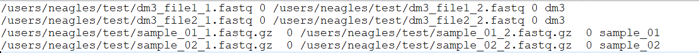

# Manifest and Inputs {#manifest}

Inputs to SPEAQeasy are specified by a single file named `samples.manifest`. The `samples.manifest` file associates each FASTQ file with a path and ID, and allows the pipeline to automatically merge files if necessary.

## What the Manifest Should Look Like

Each line in `samples.manifest` should have the following format:

* *For a set of unpaired reads* `<PATH TO FASTQ FILE>(tab)<optional MD5>(tab)<sample label/id>`
* *For paired-end sets of reads* `<PATH TO FASTQ 1>(tab)<optional MD5 1>(tab)<PATH TO FASTQ 2>(tab)<optional MD5 2>(tab)<sample label/id>`

A line of paired-end reads could look like this:

`RNA_sample1_read1.fastq    0    RNA_sample1_read2.fastq    0    sample1`

* The MD5(s) on each line are for compatibility with a conventional samples.manifest structure, and are not explicitly checked in the pipeline (you may simply use 0s as in the above example).
* Paths must be long/full.
* If you have a single sample split across multiple files, you can signal for the pipeline to merge these files by repeating the sample label/id on each line of files to merge.
* A `samples.manifest` file cannot include both single-end and paired-end reads; separate pipeline runs should be performed for each of these read types.

This is an example of a `samples.manifest` file for some paired-end samples. Note how the first sample "dm3" is split across more than one pair of files, and is to be merged:

### More details regarding inputs ###

+ Input FASTQ files can have the following file extensions: `.fastq`, `.fq`, `.fastq.gz`, `.fq.gz`
+ FASTQ files must not contain "." characters before the typical extension (e.g. sample.1.fastq), since some internal functions rely on splitting file names by ".".
