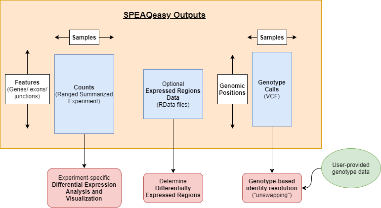

# Pipeline Outputs {#outputs}

## Main Outputs

Most importantly, SPEAQeasy generates [`RangedSummarizedExperiment`](https://bioconductor.org/packages/release/bioc/html/SummarizedExperiment.html) objects storing counts at several features (genes, exons, and exon-exon junctions). A number of [Bioconductor](https://bioconductor.org/) packages can be trivially utilized to perform desired differential expression analyses from counts in the widespread `SummarizedExperiment` format, and we provide a [vignette](NEEDS A LINK!) demonstrating an example analysis.

For human samples, variants are called at a list of common missense single nucleotide variants (SNVs), and SPEAQeasy ultimately a single VCF file to store genotype calls at these sites for all samples in the experiment. We provide a [guide](NEEDS A LINK!) walking through how this genotype data can be used to resolve identity issues that arise during sequencing, salvaging samples which otherwise might be dropped from further analysis.

Finally, expressed regions data is optionally generated (with the `--coverage` [option](#command-opts)). The `RData` files provide a starting point for finding differentially expressed regions (DERs), for analyses involving this end goal.

## Intermediary Outputs

SPEAQeasy generates a number of files along the process before producing the main outputs of interest.

[TODO: add table using markdown, similar to supplementary table in manuscript]
