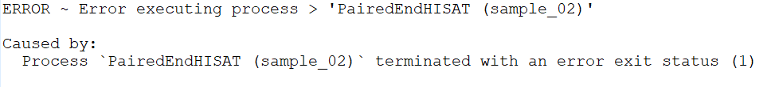
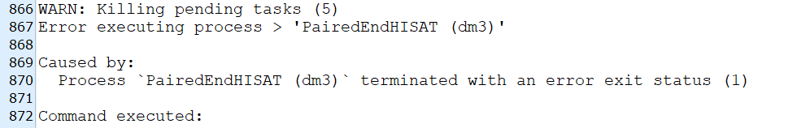
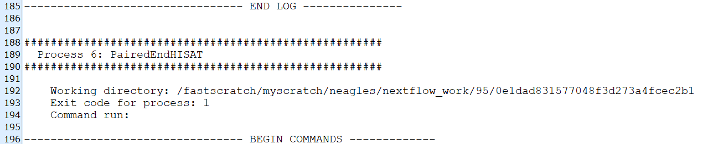
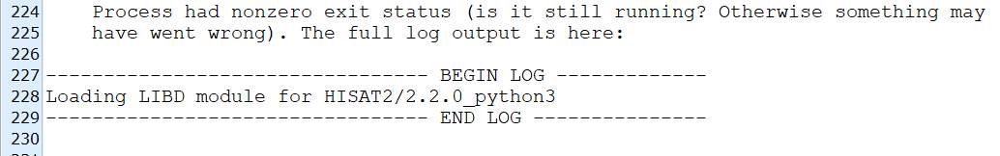

# Help {#help}

## Common Errors

SPEAQeasy should be configured so that fundamental issues related to pipeline function do not arise. If you encounter an error and believe it to be a design flaw in SPEAQeasy, you can always [submit a github issue](https://github.com/LieberInstitute/SPEAQeasy/issues). However, please take a look at the following common issues:

* *A job/ process is not given enough memory or time*: pipeline runs on large samples or datasets may require more memory or a higher time limit. When reported correctly, the pipeline will indicate an error status of 140 (for SGE or SLURM environments); however, memory issues can take many forms, and related error messages are not always clear. In this example case, the process PairedEndHISAT failed due to insufficient memory, but indicated a general error status (1):



Attempt to provide the process more memory in your config. In this case the configuration for PairedEndHISAT looks like this (for SGE users):

```{groovy, eval=FALSE}
withName: PairedEndHISAT {
    cpus = 4
    memory = '20.GB'
    clusterOptions = '-l h_fsize=500G -R y'
}
```

Note that disk space may also be the limitation (particularly for SGE users). See the [configuration](#configuration) section for more info.

* *Strandness for at least one sample disagrees with the asserted value*: all samples for a particular pipeline run are expected to have the same "strandness", specified by the `--strand` [command option](#command-opts) in your [main script](#your-main-script). SPEAQeasy infers the strandness for each sample to verify your data has its expected structure- by default, when any sample is determined to have a strandness different than what is specified, the pipeline halts with an error. This is designed to catch faulty data quickly before analysis, but also consider the `--force_strand` [command option](#command-opts) to suppress errors of this kind.

* *A backslash is missing in the main script*: in each [main script](#your-main-script), options passed to nextflow are by default split across several lines for clarity. When changing around options in this script, it is easy to omit a backslash (`\`), which is required for the script to interpret a series of lines of options as a single command. In many cases, the pipeline will run successfully-- at least for a large fraction of the workflow-- but many desired options may be completely ignored. Here is an example of the mistake in a modified version of the `run_pipeline_sge.sh` script:

```{groovy, eval=FALSE}
#  The "--output" line has no "\" at the end, and both the "--input" and
#  "-profile" options will be ignored!
$ORIG_DIR/Software/nextflow $ORIG_DIR/main.nf \
    --sample "single" \
    --reference "hg38" \
    --strand "unstranded" \
    --annotation "$ORIG_DIR/Annotation" \
    -with-report execution_reports/pipeline_report.html \
    --output "/work/SPEAQeasy/outputs"
    --input "/work/SPEAQeasy" \
    -profile sge
```

* *Nextflow has trouble communicating with your cluster*: a less common issue can occur on slower clusters, related to nextflow failing to poll your grid scheduler (like SGE or SLURM) for information it needs about the jobs that are running. This can show up in an error message like: `Process `PairedEndHISAT (Prefix: Sample_FE2P1_blood)` terminated for an unknown reason -- Likely it has been terminated by the external system`. We have found that raising the `exitReadTimeout` to a large value (such as 30 minutes) solves this issue, but consider raising it further if needed.

```{groovy, eval=FALSE}
executor {
    name = 'sge'
    queueSize = 40
    submitRateLimit = '1 sec'
    exitReadTimeout = '30 min'
}
```

## Deeper Investigation

If pipeline execution halts with an error, and the cause/solution does not appear to be described in the [common issues](#common-errors), what can be done? This section provides information about next steps for debugging a potential problem.

### Checking Per-Sample Logs

At the end of each pipeline run (whether complete or after halting due to an error), SPEAQeasy generates logs to trace the exact series of steps each sample underwent. These are designed primarily as a debugging tool, especially to catch issues that may be sample-specific. Identifying the source of an error generally involves the following steps:

1. *Identify the failing process and sample name*: the main output log from nextflow will be called "SPEAQeasy_output.log" by default (it is generally a very long text file). SPEAQeasy automatically compiles the most typically relevant information in this log; however, the error message (if applicable) at the bottom of the log is typically helpful for pinpointing the process and sample where the error occurred. *Note*: if a sample name is not given with the process name, the process involves all samples. Look for a message similar to the following:



2. *Find the SPEAQeasy-generated log for the failing sample*: logs are located under the output folder specified by the `--output` [command flag](#command-opts)- by default, this will be `SPEAQeasy/results/logs/`. Simply find the sample name given by step 1 (or pick any sample if no name was provided).

3. *Locate the process from step 1 in the log from step 2*: because the processes are in order of reported submission, the failed process will typically be near the bottom of the log. The most immediately informative portion to look for is usually the logged output from executing that process. This is at the bottom between the dashed lines labelled *BEGIN LOG* and *END LOG*. 





If the log output does not make it clear what wrong, explore the following:

- *Check the exit code*: this is near the top for a given process. An exit code of 1 is often not very informative by itself (a generic error status), but other values can sometimes inform you of the exact issue. For example, the common exit status of 140 indicates that a process failed due to exceeding memory, disk, CPU, or time constraints (for SGE or SLURM clusters). Most frequently, memory is the limiting factor; consider raising the memory allocated for the process in the relevant [configuration file](#your-config-file).

- *Check the content of the working directory*: the path to the relevant working directory is given on the first line of the log for a given process. One immediate "red flag" could be a core dump (a file named something like `core.[numbers]`). These files are produced when a process unexpectedly terminates, which often can indicate the process needs more memory or disk space (see [configuration](#configuration)). It is also worth checking for other log files (certain processes, like *SingleEndHISAT* and *PairedEndHISAT*, have output which is not printed between the *BEGIN LOG* and *END LOG* per-sample log sections).

## Resuming {#resuming}

An important feature of SPEAQeasy (because it is based on nextflow) is the ability to resume pipeline execution if an error occurs for any reason. To resume, you must add the `-resume` flag to your "main" script, determined [here](#your-main-script), and rerun. Otherwise, the default is to restart the entire pipeline, regardless of how much progress was made!

### Trouble resuming?

In some cases, nextflow will improperly determine which processes have finished, when a pipeline run halts with an error. This can be related to how your filesystem communicates with nextflow. We have found that specifying `cache = 'lenient'` in the process section of the config fixes issues with resuming (such as re-running a process which had actually completed). See [nextflow's documentation on this](https://www.nextflow.io/docs/latest/process.html#cache). In your config, this could look like:

```{groovy, eval=FALSE}
process {

  time = { 10.hour * task.attempt }
  errorStrategy = { task.exitStatus == 140 ? 'retry' : 'terminate' }
  maxRetries = 1

  // this can be placed here or anywhere inside the 'process' brackets starting
  // at the top of this code chunk
  cache = 'lenient'

  withName: PullAssemblyFasta {
    cpus = 1
    clusterOptions = '-l mf=2G,h_vmem=2G'
  }
```

This is the default in `jhpce.config`, `sge.config`, and `docker_sge.config`, but may be needed on other cluster types as well.

## No Internet Access?

* For users who do not have internet access when executing pipeline runs, you may first run `bash scripts/manual_annotation.sh`. This script must be run from the repository directory (from a machine with internet access). Modify the four lines in the "user configuration section" at the top of the script for your particular set-up. This sets up everything so that subsequent runs of the pipeline do not need an internet connection to complete.


## Docker help

For those who wish to use [docker](https://www.docker.com/) to manage SPEAQeasy software dependencies, we provide a brief set-up guide.

1. **Install docker**

A set of instructions for different operating systems are available on the [Docker site](https://docs.docker.com/installation/).

2. **Create a docker group**

```{bash, eval=FALSE}
sudo addgroup docker
```

3. **Add user to docker group**

```{bash, eval=FALSE}
sudo usermod -aG docker <your_user>
```

4. **Checking installation**

Log out and log back in to ensure your user is running with the correct permissions.

[Test Docker installation](https://docs.docker.com/get-started/#test-docker-installation) by running:

```{bash, eval=FALSE}
docker run hello-world
```
